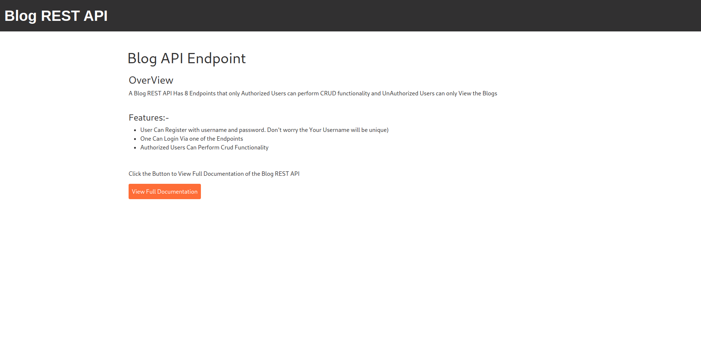
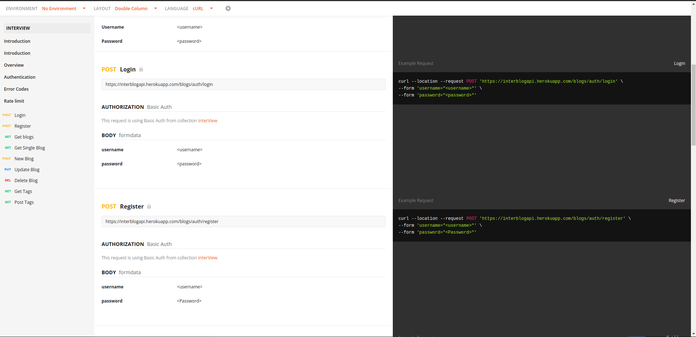
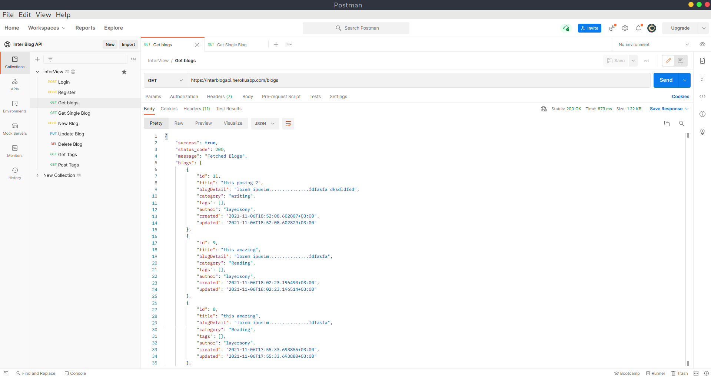

# BLOG REST API

#### By Samuel Maingi Mutunga

---
# Description  
A Simple Blog REST API with various Endpoint where logged users can Add, Update and Delete Blogs while unlogged users can only view the blogs

#### VIEW DOCUMENTATION
https://documenter.getpostman.com/view/14331044/UVC3jTC2

#### How TO Use
* Once you Register using the Register Endpoint.
* There Are 2 ways to use pass in the Login creditionals
```
Create a New Collection in Postman.
Click 3 dots on the side panel of the new Colletion you have created and Click Edit.
Navigate to Authorization and Choose Type Basic Auth.

Key in your Username and Password on the respective inputs and then Save.
Create new requests inside the collection for By default they will be inheriting the creditionals from parent.
```

Second way
```
Create a New request on Postman.
Navigate to Authorization and Choose Type Basic Auth.
Key in your Username and Password on the respective inputs and then Save.
```

Landing Page


Documentation


Get All Blogs



---
## User Stories  
Features :-

* User Can Register with username and password. Don't worry the Your Username will be unique)
* One Can Login Via one of the Endpoints
* Authorized Users Can Perform Crud Functionality

---
## Access the website
Need the latest browser to be able to View

Follow this link https://interblogapi.herokuapp.com/

It is hosted by heroku

---

## Setup and Installation  
To get the project .......  
  
##### Clone Repository:  
 ```bash 
https://interblogapi.herokuapp.com/
```

##### Install and activate Virtual Enviroment envgallery  
 ```bash 
cd interBlogapi  && python3 -m venv envblog && source envblog/bin/activate 
```  
##### Install Dependencies  
 ```bash 
 pip install -r requirements.txt 
```  
##### Setup Database  
  SetUp Database User,Password, Host then following Command  

  Create .env file
```bash
  SECRET_KEY='<SECRET_KEY>'
  DEBUG=True 
  DB_NAME='database name'
  DB_USER='database user'
  DB_PASSWORD='password'
  DB_HOST='127.0.0.1'
  MODE='dev'
  ALLOWED_HOSTS='.localhost', '.herokuapp.com', '.127.0.0.1'
  DISABLE_COLLECTSTATIC=1
```

 ```bash 
python manage.py makemigrations mainblog 
 ``` 
 Now Migrate  
 ```bash 
 python manage.py migrate 
```

##### Run Application  
 ```bash 
 python3 manage.py server 
```


Open the application on your browser `127.0.0.1:8000`.  
  
### Access Django Admin

Open Terminal type

```
python3 manage.py createsuperuser --username=<YOUR USERNAME> --email=<YOUR EMAIL>
```

Visit http://127.0.0.1/admin

## Technology used  
  
* HTML, CSS, Bootstrap

* Git

* Pythonp, Django Framework, Rest_framework

* Heroku 
  
  
## Bugs  
* None at the Moment
  
## Contact Details
sammaingi5@gmail.com

@code_with_maingi (Twitter)

---

### License
This Project is under the [MIT](LICENSE) license

Copyright (c) 2021 MaingiSamuel